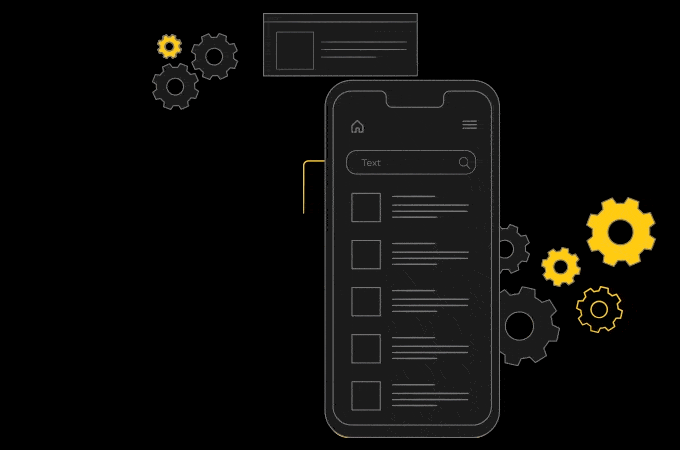
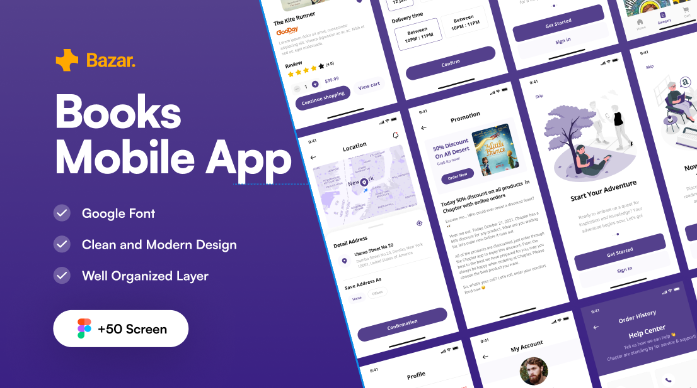
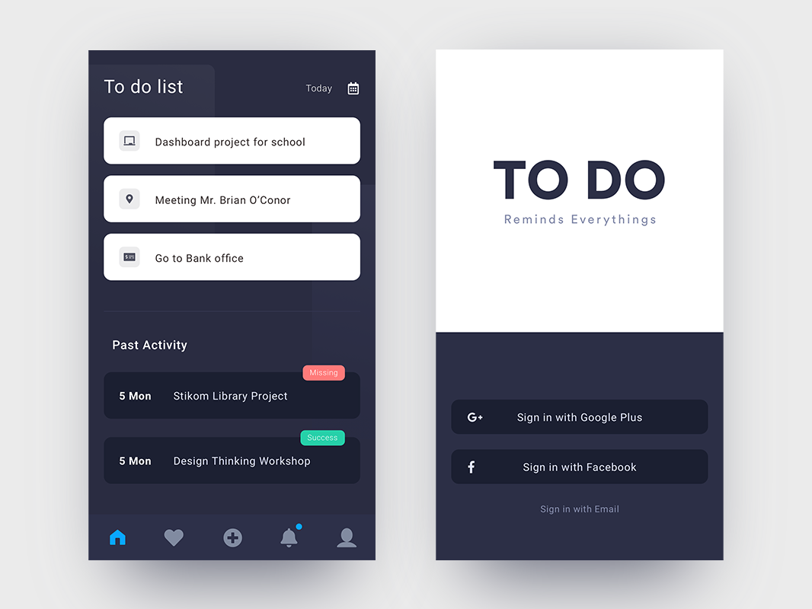
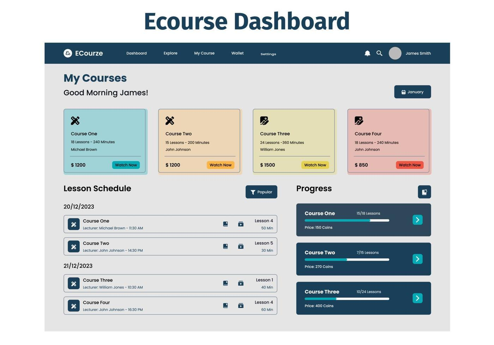
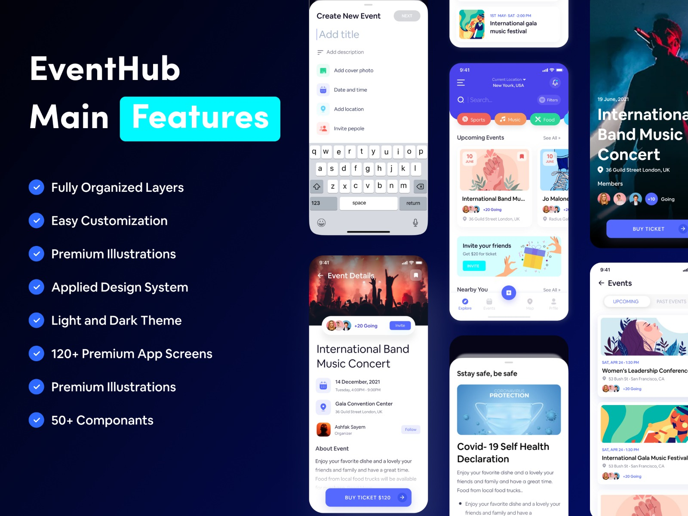

<h1 align="center">Hi, I'm Islam Ibrahim 👋</h1>

---

<table>
<tr>
<td width="50%">

#  About Me

Hi, I'm **Islam Ibrahim**  

  Second-year student at **Assiut University (PPIS)**  
  **Flutter Developer** focused on building modern, high-performance mobile applications  

  I specialize in creating clean, responsive UI and smooth user experiences using Flutter  
  Experienced in integrating **REST APIs** and building real-world applications  

  I enjoy turning ideas into fully functional mobile apps, from UI design to backend integration  

   Currently improving my skills by building real projects and exploring advanced Flutter concepts  

   I’m passionate about building scalable apps and improving problem-solving skills  

   My goal is to become a professional Flutter developer and work on impactful projects worldwide  

</td>

<td width="40%" align="center">

</td>
</tr>
</table>

---

#    My Projects
 
##   Booking App

A complete mobile application designed for booking services in a simple and efficient way.  
The app allows users to browse available services, select suitable time slots, and confirm bookings .  

It includes user authentication, dynamic data handling, and smooth navigation between screens.  
The focus was on building a real-world service-based application that solves an actual problem and improves user experience.  

###   Features:
- User login & authentication  
- Real-time data display  
- Clean and responsive UI  
- Smooth navigation between screens  

###   Tech Used:
Flutter • Firebase • REST API  

###   Screenshots:

---

##   Task Manager App

A simple yet powerful task management application built to help users organize their daily activities efficiently.  

The app allows users to add, edit, delete, and track tasks.  

This project focuses on local data handling and performance optimization for smooth usage.  

###   Features:
- Add / Edit / Delete tasks  
- Local data storage  
- Fast and responsive performance  
- Simple and user-friendly UI  

###   Tech Used:
Flutter • Dart • SQLite  

###   Screenshots:

---

##    E-Courses Platform

A web-based platform designed to provide online courses and educational content.  

The platform allows users to browse courses, view content, and interact with the system in a structured and organized way.  

This project helped me understand fullstack basics and how to connect frontend with backend logic.  

###   Features:
- Course browsing system  
- Structured content display  
- Simple and clean web interface  
- Organized data presentation  

###   Tech Used:
C# • HTML • CSS  

###   Screenshots:

---

## 🎉 Event Booking UI

A modern UI design for an event booking application built by  Flutter.  

This project focused on creating an attractive and smooth user interface that enhances user experience.  

It demonstrates my ability to design professional UI layouts and build responsive mobile screens.  

###   Features:
- Modern UI design  
- Smooth layout structure  
- Responsive screens  
- Clean and organized components  

###   Tech Used:
Flutter (UI Only)  

###  Screenshots:

---

#  Services

  Build full mobile applications using Flutter  
  Design modern, responsive, and user-friendly UI  
  Integrate REST APIs and backend services  
  Fix bugs and improve app performance  
  Convert ideas into real, functional mobile applications  

---

#   Connect With Me

  **Phone:** 01220604296  

---

#    Tech Stack

###   Mobile Development

###  Web Basics

###   Databases

###   Tools

---

#   GitHub Stats

---

#    GitHub Streak

---

  From [Islam Ibrahim](https://github.com/islamzaltaa-hub)